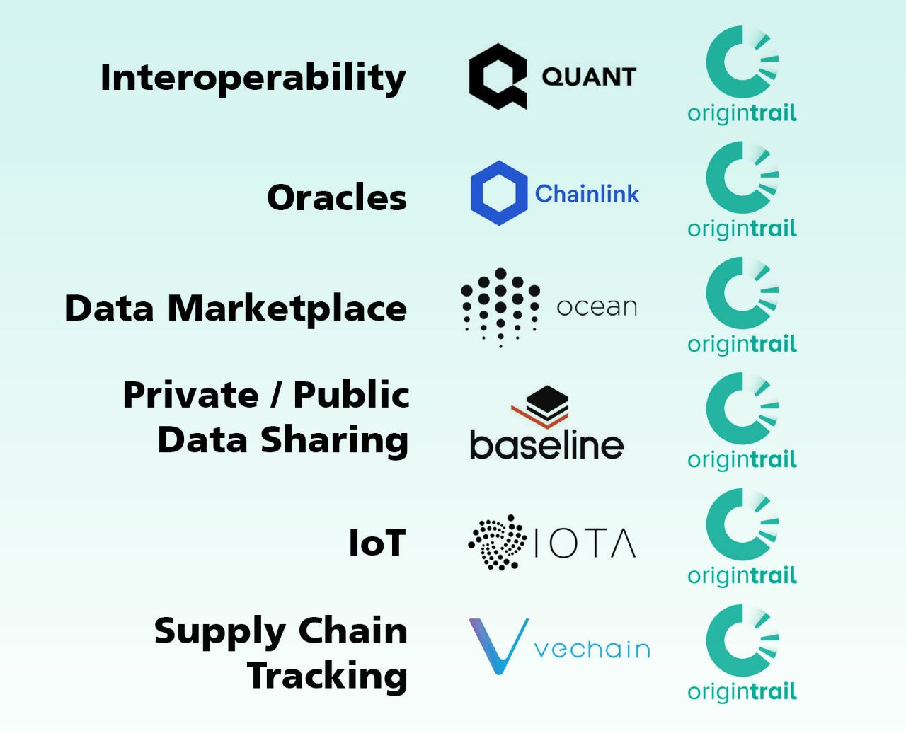

# Competitors

<figure><figcaption></figcaption></figure>

In this section, I will briefly touch upon every project that share a few similar aspects with OriginTrail. Despite what is shown on the illustration above, OriginTrail does not have any competitors. As one of the core values of neutrality dictates, the ODN is built with the adoption of co-creation principles and collaboration with all other ecosystems in mind. The Decentralized Knowledge Graph can be built on top of any projects, allowing each entity to break data silos and make use of global standards.&#x20;

SM, a supply chain expert who worked with complex ERP systems for over a decade, wrote the following:

Crypto media tends to mix Vechain, Te-Foods, Walton Chain, Ambrosus, OriginTrail and Morpheus together calling them supply chain projects. That assumption is false. Understandably, very few investors or media outlets have extended knowledge of the backend system operations which are basically complex ERP systems that supply chains rely on (Oracle NetSuite, SAP, Microsoft Dynamics, and plethora of other systems), and which allow companies to do their day-to-day operations. In other words, most of these projects are not supply chain solutions as they only scrape the surface layer of the supply chain ecosystem. Most of these are traceability projects, promising to verify that consumers are getting products that producers say they are. In no way are the majority of these projects solving the main issues that have been plaguing the supply chain industry for a very long time, which is the lack of seamless and decentralized interoperability and interconnectivity of siloed legacy systems and storages, where all systems are communicating effortlessly, abiding by the strict rules of global standards without the need to create complex customizations each time you are dealing with a system you haven’t dealt with before.&#x20;

Here is an example:

If company A runs system X, company B system Y, and company C system Z, they don’t need to create 6 to 9 different customizations to whatever ERP system they are using in order to communicate with each other. With the OriginTrail protocol, each company uploads their data via the ODN (OriginTrail Decentralized Network) in order to share whatever needs to be shared, keeping their costs down and avoiding expensive expansions into other systems that their clients/vendors/suppliers may demand.

