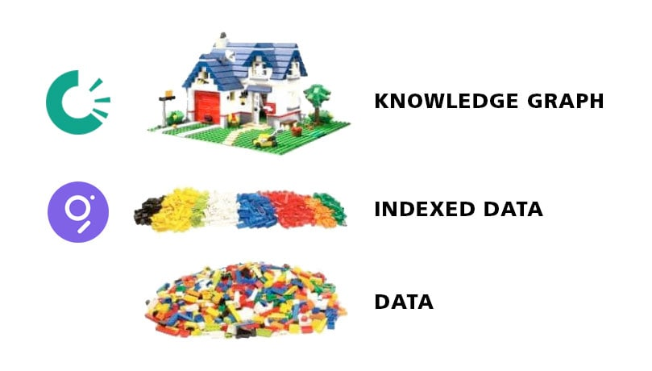

# OriginTrail and The Graph

<figure><figcaption></figcaption></figure>

The Graph name just comes from GraphQL, which is query language for APIs, that allows you to define the structure of any data returned by a request. The Graph is also used for indexing blockchain data that is relevant to its user (subgraph) which is a very different use case as these dapps require fresh accurate data and instantly.&#x20;

OriginTrail is a decentralized knowledge graph - decentralized nodes on a network where data can be persisted for a certain amount of time. The knowledge graph data model allows for complex relationships between entities to be easily represented and queried. **Things not Strings**.

The video below is a more in depth comparison of the two projects.&#x20;


