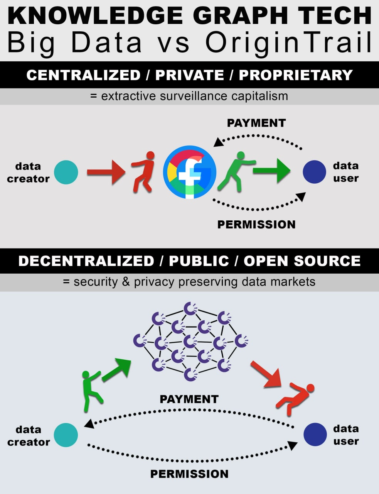

# Knowledge Graph

<figure><figcaption></figcaption></figure>

Before we tackle the Decentralized Knowledge Graph, let's take a look at the knowledge graph.&#x20;

> According to [Wikipedia](https://en.wikipedia.org/wiki/Knowledge\_graph), a “**knowledge graph** is a knowledge base that uses a graph-structured data model or topology to integrate data”.&#x20;

In other words, a KG connects various data such as objects, locations, people, events, dates, etc. together to create meaning - a knowledge base. [Here](https://internationalbanker.com/finance/knowledge-graphs-powerful-structures-making-sense-of-data/) is a useful link that describes the utility of a knowledge graph in more technical terms. Most knowledge graphs today are private and owned by big tech companies such as Google, Facebook, Amazon, IBM, AirBnB, Uber, LinkedIn. These companies have private KGs to make sense of the vast data that they collect from their users. Unknowing users give their data freely to these corporations while using their products, which then gets monetized with the help of a KG in a siloed environment.

<figure><figcaption></figcaption></figure>

OriginTrail uses a Decentralized Knowledge Graph by having nodes running on the ODN across the globe, which are not siloed and can be run by anybody. Data is stored on nodes rather than private enterprise servers, allowing for companies (_or individuals for that matter_) to share, exchange or monetize their data while retaining their profits or anonymity. The ODN allows companies to select which data a company wants to keep private and what they wish to share. It’s a complete shift toward a more transparent and less centralized way of conducting business without having to rely on a 3rd party.

For an in depth explanation of what the DKG is, Branimir gives a great demonstration on the video below during the Knowledge Graph Conference 2022. A must watch.



For a shorter less technical explanation, I suggest the video below filmed during Polkadot Davos 2022.



