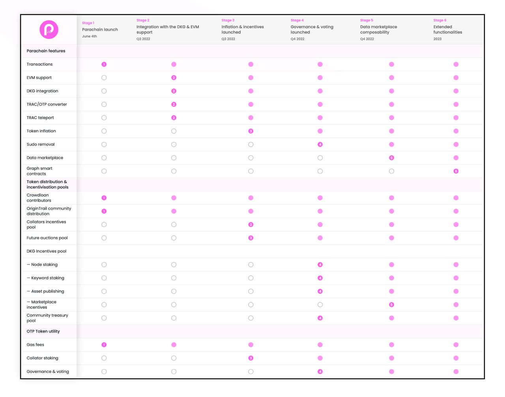

# Blockchain Layer

OriginTrail is an open protocol, basically the combination of two key technologies - Knowledge Graphs and Blockchains. However, OriginTrail is **not a blockchain** itself - it is **** an off-chain decentralized network that works together with the blockchain layer. In fact, it is designed from the start to be interoperable with all blockchains - it is complementary, middleware solution, focused on the interconnectivity of data as an underlying problem. In othe words, OriginTrail is a **layer-2 multichain and agnostic protocol** that goes on top of blockchains and is utilizing blockchain for data immutability and decentralization. It is a multichain solution and can be integrated on top of any blockchain. Currently, OriginTrail’s decentralized protocol is operating on DOT, ETH, xDAI and MATIC.&#x20;

<figure><figcaption></figcaption></figure>

## OriginTrail Parachain



OriginTrail won the [**Polkadot Parachain auction slot #17**](https://parachains.info/details/origintrail) on May 2022, and has been working closely with the [Parity Technology team who joined the Trace Alliance](https://medium.com/origintrail/parity-technologies-joins-trace-alliances-working-group-on-decentralization-and-tokenomics-8eaad2843ca7).  The OriginTrail core development team was also selected for [the Substrate Builders program](https://www.substrate.io/builders-program/) by Parity technologies.&#x20;

Below is the current roadmap of OriginTrail Parachain as of September 2022

<figure><figcaption></figcaption></figure>

Once the new OriginTrail protocol goes live, we expect most network activity to migrate over to the OriginTrail Parachain, a blockchain tailored to the DKG, which uses the layer-1 token OTP as a gas and incentivisation token.&#x20;



## **Other Blockchain Integrations**

TRAC remains a ERC-20 token that’s available on the Ethereum network. However, due to high network fees, network activity moved towards Gnosis and Polygon chains, and as of September 2022, most network activity are expected to migrate towards OT Parachain due to the new v6 iteration being exclusive to the OT Parachain for the time being.&#x20;

The team is currently [Teleporting TRAC](https://teleport.origintrail.io/) from the Ethereum Blockchain to the OT Parachain by locking ERC-20 TRAC in a smart contract and minting OT Parachain native TRAC to be used for network activities within the DOT ecosystem. A complete [guide](../guides-and-tools/trac-teleportation-faq.md) regarding the Teleportation process is available.&#x20;

The migration from the Ethereum blockchain to Gnosis and Polygon chains, and then to OT Parachain showcases the interoperable nature of TRAC. OriginTrail’s ecosystem can be part of any blockchains or legacy systems and can easily adapt to an evolving market.&#x20;


Note that the total amount of token does not change after the teleportation.&#x20;

