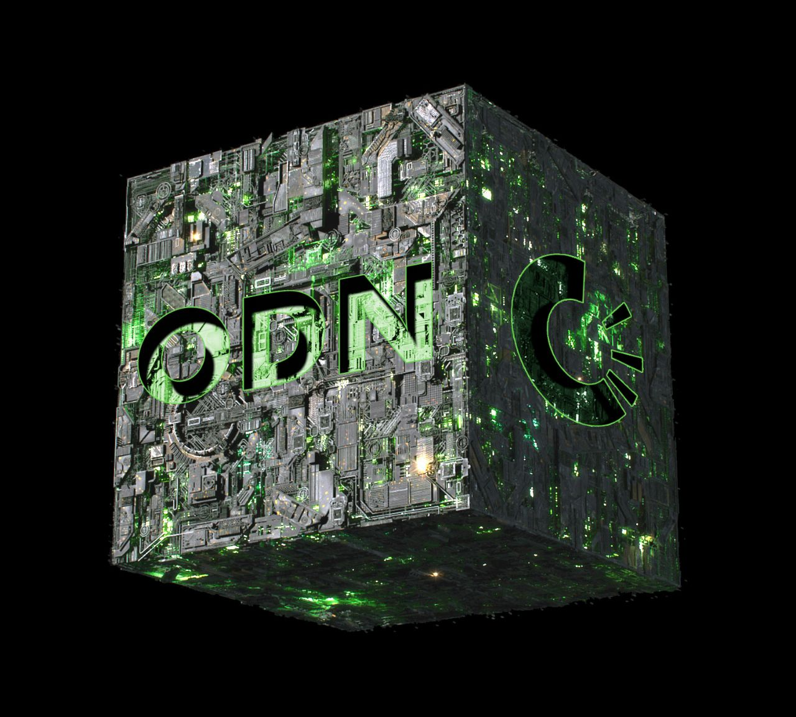

# Foundation

The **OriginTrail Decentralized Network (ODN)** is a neutral, open-source protocol enabling secure  peer-to-peer data sharing between companies and supply chains. It utilizes decentralized nodes and an off-chain technology stack to interface with legacy systems as well as other blockchains (permissioned and permissionless). OriginTrail allows businesses to improve interoperability among different IT systems by removing data silos, ensuring data integrity, immutability and traceability by fingerprinting a cryptographic data hash of the data to a blockchain and facilitating trusted data exchange. The most recent implementations allows the transformation of all legacy data into Web3 assets, bringing the physical world (art, fashion, healthcare, education, supply chains,etc.) to the digital world (blockchain, DeFi, Metaverse, NFTs) and making them more discoverable, verifiable and valuable.

## **Core Values**

<figure><figcaption></figcaption></figure>

The OriginTrail protocol has been built from the ground up with 3 core pillars:&#x20;

### **1. Neutrality**

OriginTrail's first core value ensures the inclusiveness of all parties, adoption of co-creation principles and collaboration with all other ecosystems. In order to maintain compatibility of all data from multiple parties, including both legacy IT systems and new digital systems such as blockchains, OriginTrail must adhere to the highest globally recognized standards such as GS1 and W3C, and remain open-source and decentralized. This prevents vendor lock-ins, ensures integrity and in return breaks data silos. The principle of neutrality is applied on all levels, including interoperability between any blockchains, integration with any legacy systems by applying open standards and allowing any users to review the open-source code.&#x20;

### **2. Usability**

In order to onboard users, enterprises and developers to the OriginTrail protocol, the network underpinning Web3 protocol level technologies must be efficient and user friendly. Trace Labs, the company behind OriginTrail, has developed many interface solutions used within [global enterprises and government bodies](https://origintrail.io/case-studies). The team has also built [Project Magnify](https://projectmagnify.io/), a DKG client for any users to publish assets directly into the ecosystem without the need to run a node. Improved usability of the ODN will only drive positive network effects to grow the entire ecosystem.&#x20;

### **3. Inclusiveness**

As the ecosystem grows, the team needs to continue forming partnerships with business global leaders and communities to cater to their needs. This will continue pushing the team to make new strides in designing technical infrastructures and business models that support the worldwide adoption of OriginTrail. This in turn will cycle back to the first core value of neutrality.
