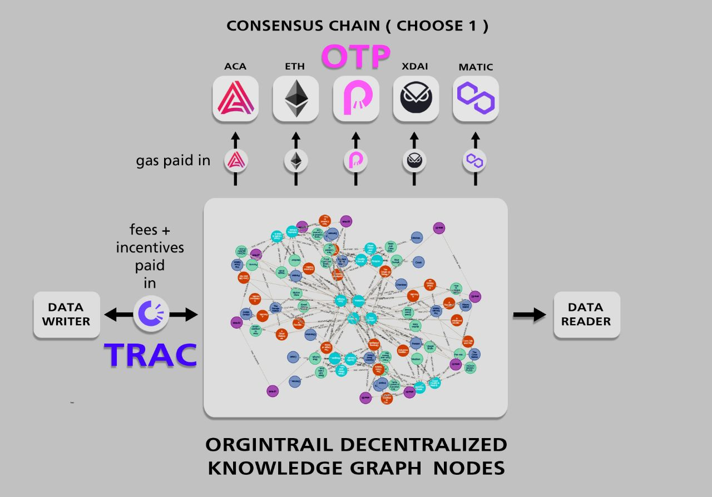

# Part 3: Blockchain

[**OriginTrail**](https://origintrail.io/) **** is **not a blockchain** – it is a **layer-2 agnostic protocol** that goes on top of blockchains and is utilizing blockchain for data immutability and decentralization. It is a multichain solution and can be integrated on top of any blockchain. Currently, OriginTrail’s decentralized protocol is operating on DOT, ETH, xDAI and MATIC.&#x20;

<figure><figcaption></figcaption></figure>

## OriginTrail Parachain



OriginTrail won the [**Polkadot Parachain slot #17**](https://parachains.info/details/origintrail) on May 2022, and has been working closely with the [Parity Technology team who also joined the Trace Alliance](https://medium.com/origintrail/parity-technologies-joins-trace-alliances-working-group-on-decentralization-and-tokenomics-8eaad2843ca7). [DOT integrations](https://medium.com/origintrail/trace-labs-origintrail-core-developers-selected-for-paritys-substrate-builders-program-e00a9b65bee) have been worked by both parties for over a year. Once the new OriginTrail protocol goes live, we expect most network activity to migrate over to the OriginTrail Parachain, a blockchain tailored to the DKG, which uses the layer-1 token OTP as a gas and incentivisation token.&#x20;



## **Other Blockchain Integrations**

TRAC remains a ERC-20 token that’s available on the Ethereum network. However, due to high network fees, network activity moved towards Gnosis and Polygon chains, and as of September 2022, most network activity are expected to migrate towards OT Parachain due to the new v6 iteration being exclusive to the OT Parachain for the time being.&#x20;

The team is currently [Teleporting TRAC](https://teleport.origintrail.io/) from the Ethereum Blockchain to the OT Parachain by locking ERC-20 TRAC in a smart contract and minting OT Parachain native TRAC to be used for network activities within the DOT ecosystem. A complete [guide](../guides-and-tools/trac-teleportation-faq.md) regarding the Teleportation process is available.&#x20;

The migration from the Ethereum blockchain to Gnosis and Polygon chains, and then to OT Parachain showcases the interoperable nature of TRAC. OriginTrail’s ecosystem can be part of any  blockchains or legacy systems and can easily adapt to an evolving market.&#x20;


Note that the total amount of token does not change after the teleportation.&#x20;


### **StarFleet Chain (SFC)**

Originally, the 6-month staking that occurred during February 2021 was supposed to lock-up 100M TRAC for the launch of OT’s own blockchain called Starfleet Chain, or SFC for short. This did not happen even though the team did imply that we would get the Polkadot integration regardless after SFC was up and running. Most community members believe the change of plans was for the better.

In the [bi-yearly H2 2021 report](https://medium.com/origintrail/origintrail-bi-yearly-report-h2-2021-making-humanitys-most-important-assets-discoverable-af873702d807), OT has since called SFC a phase for overlaying the DKG onto the Gnosis and Polygon blockchains and moved on to focus on OT Parachain.
