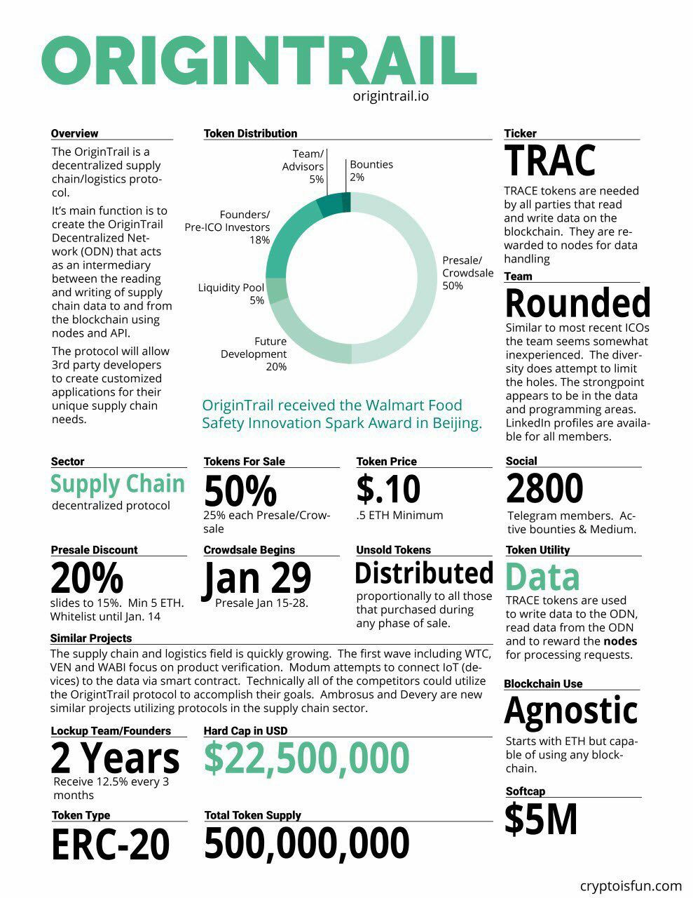

# Part 4: Tokenomics

## **Tokenomics**

<figure><figcaption></figcaption></figure>

### **TRAC token**

The TRAC token has existed since late 2017, with the ICO priced at 0.10$. You can take a look at the illustration below for more information. &#x20;

<figure><figcaption></figcaption></figure>

Despite being an ICO in late 2017, the team has been developing its technology for over a decade. For advanced deep divers, you can have a look at the [**original 2017 whitepaper**](https://origintrail.io/storage/documents/OriginTrail-White-Paper.pdf). For common deep divers, [**here**](https://parachain.origintrail.io/whitepaper) **** is the **new** **2022 whitepaper**.

[Coingecko](https://www.coingecko.com/en/coins/origintrail) shows the current circulating supply at 368Mn/500Mn. The remainder 132M tokens are tagged for the dev pool and future development and maintenance of the ODN protocol.&#x20;

OriginTrail TRAC layer-2 token is the life and blood of the entire ecosystem. It is required to perform all operations on the DKG. It is an utility token that drives the entire network :

* **Publishing and updating assets** – asset creators, such as enterprises, organizations, companies, even individuals must use TRAC to compensate OriginTrail node runners for holding their data for a period of time. This will be the main driving for TRAC’s tokenomics.
* **Collateral on OriginTrail nodes** – node runners must lock up TRAC as a collateral for holding asset publishes. The more TRAC locked up in the node, the more likely the node is chosen as the asset holder.
* **Delegating to nodes** – token holders who do not wish to maintain a node have the possibility to delegate their TRAC to node runners, and in return obtain a portion of the rewards.
* **Keyword staking** – Assets owners (enterprises, organizations, companies or individuals) can lock up TRAC to have their assets prioritized in a search result for a particular keyword, similar to [Google AdSense](https://www.google.com/adsense/start/). This is akin to a decentralized form of marketing spending in Web3 fashion.
* **Data marketplace** – TRAC as a fungible token under ERC-20 standards is transferable and usable in any way ERC-20 assets are. TRAC can therefore be used in smart contracts that allow TRAC to be used as a compensation token for selling or buying assets. Data creators can earn from ownership of valuable data assets

<figure><figcaption></figcaption></figure>

### **OTP token**

OTP has a total supply of **1 billion tokens**. Half of those tokens will be initially allocated (25% at genesis distribution, the rest over the course of the 2 year lease period), while the remaining will be minted through inflation in perpetuity for future use such as for parachain auctions every 2 years. The token had no presale and no pre-distribution. The token has a **5% inflation** rate per year. The distribution is as follows :

* **Kick-starting incentivisation pools** (45% or 225M)
  * Collator incentives pool (70M) – This pool is to reward selected collators and their delegators performing their network functionalities (producing blocks submitted to the Polkadot Relay chain validators)
  * Future auctions pool (70M) – This pool ensures that enough OTP is available to reward future participants in auctions
  * DKG incentives pool (70M) – This pool supports ALL types of activity by the OriginTrail community for supporting activities on the DKG, such as publishing/updating, staking, delegating, keyword staking, using TRAC data marketplaces and any other activities promoting the usage of the DKG
  * Community treasury pool (15M) – This pool, alongside the OTP voting mechanism, will help promote a wide range of activities by the OriginTrail community
* **Initial auction distribution** (25% or 125M)
  * This pool is intended to reward parachain participants, providing up to 25 OTP per 1 DOT contributed, up to a total of 5M DOT. Any unspent OTP from the initial auction process will be added to the Future auctions pool.
* **OriginTrail community distribution** (5% or 25M)
  * TRAC token holders will receive 1 OTP per 25 TRAC held, up to 20M OTP.
  * TRAC node runners will receive a total of 5M OTP.
* **Treasury** (25% or 125M)
  * This pool allows for future development of the OriginTrail Parachain, voting process for on-chain upgrades, incentivising key team members and advisors
  *

      <figure><figcaption></figcaption></figure>

The OTP token is designed as a **gas and reward token**. Rather than relying on ETH, MATIC, XDAI as gas fees for transactions on the past version of the DKG before the parachain, OTP will be used to pay for gas on the OriginTrail Parachain, allowing to keep more value within the OriginTrail ecosystem. OTP is also a reward token that **incentivises growth** of the DKG on the Origintrail Parachain, making sure the **OriginTrail Parachain is the most attractive blockchain layer for the DKG**. In other words, our parachain (L-1) requires a token, OTP, to function as gas for transactions and as a reward for [collators](https://wiki.polkadot.network/docs/learn-collator) for processing blocks back to Polkadot (L-0). The DKG (L-2), powered solely by TRAC, is interoperable and therefore not exclusively linked to the parachain – it is still fully functional on Gnosis, Polygon and Ethereum. However, future network users will be favoring the OT parachain due to OTP which will not only serve as a reward token for collators for processing blocks back to Polkadot, but also for node runners and data publishers to incentive network activity on the parachain. Both use cases above synergize with the TRAC token.

Below is a detailed description of the OTP utility token:

* **Gas fees** for transactions and smart contracts (and graph contracts to come)
  * Locking up OTP reduce gas fees on the network utilizing a subscription model
* **Incentivising collators** to perform network functions
  * Locking up OTP is required to signal the amount of stake they are willing to keep locked for a particular period of time in order to receive collator rewards.
  * The higher the locked amount, the greater the chance a collator candidate gets placed in the group of rewarded collators
* OTP holders can **delegate to collators** and earn part of the reward
* OTP holders cau lock their OTP to **vote on update proposals** for OriginTrail Parachain network and community treasury proposals
* OTP as a fungible token, just like TRAC, can be used in a **data marketplace** environment using smart contracts

<figure><figcaption></figcaption></figure>
